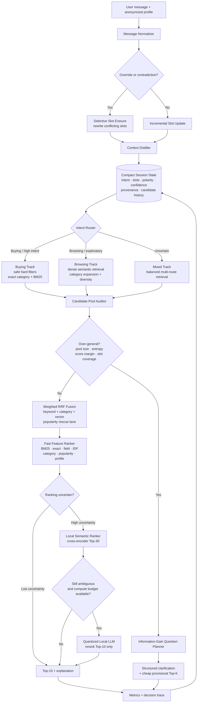

# Adaptive Dual-Route Shopping Copilot

## Architecture and Implementation Plan

This document defines the target architecture for TikTok TechJam 2026 Track 4.
It is intended to be an implementation contract: each component has a clear
responsibility, inputs, outputs, fallback path, and measurable acceptance
criteria.

The design objective is not to replace the current high-scoring deterministic
agent. The current agent becomes the reliable offline core and fallback while
we add genuine dual-route retrieval, selective state evolution, candidate-aware
clarification, dense semantic retrieval, and uncertainty-gated semantic ranking.

## 1. Goals and constraints

The system must optimize four dimensions together:

1. **Accuracy:** preserve or improve public-set HR@10, MRR, and MTTC while
   improving robustness to paraphrases, missing metadata, and genuine intent
   changes.
2. **Feasibility:** run offline on local CPU with no external vector database,
   no required API credentials, and no network dependency.
3. **Efficiency:** use cheap deterministic stages first and invoke expensive
   semantic models only when their expected ranking value justifies the cost.
4. **Innovation:** make retrieval topology, clarification, context construction,
   and compute allocation adapt to the live candidate pool and conversation
   state rather than following a fixed pipeline.

Non-negotiable safeguards:

- The catalog remains read-only.
- The official evaluator and public labels remain unchanged.
- Every optional model has a deterministic fallback.
- No private-set assumptions are represented as measured facts.
- Public-set score is reported as a development score, not an unbiased private
  estimate.

## 2. Current baseline

The frozen deterministic baseline is the foundation of the target system:

- SQLite FTS5/BM25 retrieval.
- Incremental category, term, and phrase state.
- Feature reranking using BM25, phrase, exact-field, IDF, category, popularity,
  and slot-level soft overlap.
- Offline CPU-only operation with zero API cost.
- Public development score around 0.9287 with 199/200 sessions hit.
- Pool-aware clarification, selective override, and profile-weight experiments
  now exist, but some remain non-default because the public simulator does not
  reward them.

The target architecture must retain a configuration that reproduces this
baseline exactly. New capabilities must be evaluated for both clean-score
regression and robustness benefit.

## 3. End-to-end runtime flow



Runtime principle:

> Cheap first -> measure uncertainty -> clarify or retrieve -> invoke semantic
> computation only when it has positive expected value.

The system may ask a question and return provisional recommendations in the
same response. When the candidate pool is too general, "retrieval cutoff"
means stopping expensive retrieval and semantic ranking, not returning an empty
recommendation list.

## 4. Component boundaries

### 4.1 Catalog Intelligence Layer

#### `CatalogNormalizer`

Responsibilities:

- Normalize title, category, features, details, store, brand, price, material,
  color, size, style, feature, and use-case text.
- Build typed facet values and preserve missing-value provenance.
- Store normalized product text once rather than duplicating full strings in
  several Python dictionaries.

Outputs:

- Normalized product records.
- Typed facet values.
- Compact numeric metadata arrays.

#### `LexicalIndex`

- Retain SQLite FTS5/BM25.
- Retrieve exact terms, brands, attributes, and catalog language efficiently.
- Support route-specific field weights.

#### `CategoryIndex`

- Build category and subcategory postings.
- Support category expansion for browsing queries.
- Provide category-distribution statistics to the Candidate Pool Auditor.

#### `DenseIndex`

- Precompute one compact embedding per product.
- Use float16 or int8 storage; 50,000 x 384 embeddings require roughly 38 MB
  in float16 or 19 MB in int8 before index overhead.
- Use local CPU brute-force matrix similarity or a lightweight in-process ANN
  index. Do not require an external vector database.

#### `FacetIndex`

- Map typed values such as category, material, color, size, brand, budget, and
  use case to product identifiers.
- Expose coverage statistics so low-coverage fields are not used as unsafe hard
  filters.

#### `PopularityPrior`

- Retain rating/count signals as a prior.
- Use Bayesian smoothing or another bounded transform.
- Never allow popularity to override a verified hard constraint.

### 4.2 Structured Conversation State

Replace raw term accumulation as the primary abstraction with typed state:

```text
SessionState
├── route: buying | browsing | mixed
├── route_confidence
├── category
├── hard_slots
├── soft_slots
├── negative_slots
├── profile_priors
├── asked_attributes
├── candidate_statistics
├── ranking_history
├── turn_budget
└── fallback_status
```

Each slot should record:

```python
SlotValue(
    attribute="material",
    value="leather",
    polarity="positive",
    hardness="hard",
    confidence=0.94,
    source_turn=2,
    provenance="explicit_user",
    active=True,
)
```

Rules:

- Explicit current-turn requirements outrank profile priors.
- Hard and soft preferences remain distinct.
- Negated values enter `negative_slots` rather than disappearing.
- Inferred values have lower confidence than explicit values.
- Old soft preferences may decay; hard constraints do not decay without an
  override or contradiction.

### 4.3 `IntentRouter`

Inputs:

- Current message.
- Distilled session state.
- Previous route and candidate statistics.

Outputs:

- `buying`, `browsing`, or `mixed`.
- Route confidence.
- Override and contradiction flags.

Implementation strategy:

1. Fast deterministic cues for known protocol messages.
2. Slot density, hard-constraint language, and category specificity.
3. A small local classifier only if deterministic confidence is low.

The route must affect retrieval topology, question policy, fusion weights, and
ranking weights. Merely storing a route label does not satisfy dual-track
routing.

### 4.4 `SelectiveOverrideManager`

The manager must support genuine intent replacement:

- Replace a category when the new message specifies a different category.
- Remove or deactivate category-dependent slots when the user says "start
  over", "forget", or equivalent.
- Replace values that conflict within the same attribute.
- Preserve stable, non-conflicting preferences.
- Move explicitly rejected values to negative state.
- Keep the old state in an audit trail but exclude inactive values from active
  retrieval.

Example:

```text
Before:
  category=boots, color=black, material=leather, use_case=winter

User:
  "Forget boots. I need lightweight running shoes, but black is still good."

After:
  category=running shoes
  hard/use_case=running
  hard/feature=lightweight
  soft/color=black
  inactive=boots, winter
  material=deactivated or reduced confidence
```

The current `keep` policy remains available as a public-simulator ablation, not
as the product-semantics default.

### 4.5 `ContextDistiller`

Convert conversation history into compact structured context rather than
reusing the raw transcript:

```json
{
  "route": "buying",
  "category": "running shoes",
  "hard": {"use_case": "running", "feature": "lightweight"},
  "soft": {"color": "black", "style": "minimal"},
  "negative": {"category": ["winter boots"]},
  "profile_prior": {"comfort": 0.15, "durability": 0.10},
  "uncertainty": {"category": 0.08, "material": 0.72}
}
```

The same distilled context is consumed by routing, question planning, dense
query construction, semantic ranking, and explanation generation.

### 4.6 `PersonalizationAdapter`

- Translate provided anonymized preference tags into weak feature priors.
- Cap personalization weights so they never become hard filters.
- Disable a profile preference when contradicted by the current session.
- Preserve provenance: profile-derived preferences are not user-stated facts.
- Do not reconstruct raw identities or histories.

The public profile currently carries little useful target signal. This is a
measured negative result, not a reason to omit the architecture. The adapter
should exist, default to a safe zero or very small weight, and be tested on both
the public profile and controlled informative-profile scenarios.

## 5. Dual-track retrieval

### 5.1 Buying Track

Use when category and hard-slot confidence are high.

```text
Safe hard filters
-> exact category/facet retrieval
-> BM25 retrieval
-> dense rescue lane
-> constraint-heavy ranking
```

Rules:

- Strictly filter only on fields with adequate catalog coverage and reliable
  parsing.
- Use soft penalties for low-coverage metadata.
- Always preserve an unfiltered rescue lane so a parsing or metadata error does
  not permanently remove the target.
- Prioritize hard-slot satisfaction, exact-field match, and contradiction
  penalties above popularity.

Initial candidate budgets to test, not assume:

- facet/category: Top-80;
- BM25: Top-100;
- dense rescue: Top-30;
- fused pool: Top-100.

### 5.2 Browsing Track

Use when the user is exploratory, provides a use case rather than a product
name, or has weak category certainty.

```text
Dense semantic retrieval
+ category expansion
+ BM25
+ popularity/diversity rescue
-> route fusion
-> candidate-aware clarification
```

Rules:

- Emphasize semantic and use-case similarity.
- Allow cross-subcategory discovery.
- Apply modest diversity only while the user remains exploratory.
- Preserve the highest-relevance positions so diversity does not unnecessarily
  damage MRR.
- Transition automatically to Buying when enough hard information accumulates.

### 5.3 Mixed Track

Use when router confidence is low:

- run lexical, category, and dense retrieval with balanced weights;
- avoid strict filtering;
- ask the question with the highest expected information gain;
- re-route after the next informative answer.

## 6. Multi-route fusion

Every retrieval route returns product IDs, route scores, and ranks. Fuse them
with route-conditioned Weighted Reciprocal Rank Fusion:

```text
fusion_score(product) =
    sum(route_weight(route, state) / (k + route_rank(product)))
```

Starting weight profiles for experiments:

| Route | Buying | Browsing | Mixed |
|---|---:|---:|---:|
| Facet/category | 0.35 | 0.20 | 0.25 |
| BM25 | 0.35 | 0.20 | 0.30 |
| Dense | 0.15 | 0.40 | 0.30 |
| Popularity/rescue | 0.15 | 0.20 | 0.15 |

These are hypotheses. Select weights using controlled ablations and robustness
suites, not by repeatedly optimizing the same public aggregate score.

## 7. Candidate Pool Auditor and retrieval cutoff

The auditor measures:

- effective candidate count;
- number and confidence of hard slots;
- category entropy;
- score entropy;
- Top-1/Top-10 margin;
- route disagreement;
- catalog-field coverage;
- turns remaining;
- previous question yield.

Example over-generality condition:

```text
effective_candidates > threshold
AND hard_slot_count == 0
AND top10_margin < threshold
```

When over-general:

1. Stop expensive dense expansion, cross-encoding, and LLM ranking.
2. Sample the cheap candidate pool.
3. Select the best clarification attribute by expected information gain.
4. Return a structured question and a cheap provisional Top-K.

This preserves evaluator MTTC opportunities while satisfying the requirement
to cut off an overloaded retrieval pipeline.

## 8. Information-Gain Question Planner

Do not use a fixed attribute cycle as the product strategy. Estimate:

```text
ExpectedUtility(attribute) =
    ExpectedCandidateReduction
    * ProbabilityUserCanAnswer
    * AttributeReliability
    / ExpectedExtraTurns
```

Use candidate value distributions to estimate entropy. Avoid questions where:

- almost every candidate has the same value;
- the field is missing for most candidates;
- the user already answered the attribute;
- the public simulator has repeatedly returned no information.

Questions should be structured and natural, for example:

> To narrow this down, is this mainly for running, hiking, or everyday wear?

`ask_attribute="other"` remains a compatibility fallback, not the main product
policy. The existing pool-aware policy is the starting implementation and must
be extended to use typed facet values, missingness, and expected answerability.

## 9. Ranking stack

### 9.1 Level 1: deterministic feature ranker

Apply to the fused Top-100:

- normalized BM25;
- phrase and exact-field match;
- IDF-weighted coverage;
- hard-slot satisfaction;
- negative-slot contradiction penalty;
- category compatibility;
- route-specific popularity prior;
- bounded profile prior;
- missing-metadata confidence.

This is the default and final fallback.

### 9.2 Level 2: local cross-encoder

Apply only to Top-20 or Top-30 when expected to help:

- Input query: distilled intent, active slots, and negative constraints.
- Input document: title, category, and selected catalog features.
- Primary purpose: paraphrase, reordered phrases, use-case semantics, and cases
  where exact catalog strings are absent.

The model must be quantized or otherwise CPU-appropriate. Measure clean-score
regression, paraphrase recovery, latency, and memory before enabling it by
default.

### 9.3 Level 3: uncertainty-gated local LLM

Use a small quantized local instruction model only when:

- Top candidates have very small score margins;
- feature ranker and cross-encoder disagree;
- an override contains complex compositional requirements;
- dead-slot/paraphrase evidence is high;
- sufficient turn and latency budget remains.

Input only the distilled context and Top-10 compressed product summaries.
Require a deterministic permutation response, temperature zero, and a short
output budget.

Fallback chain:

```text
Local LLM timeout/failure
-> cross-encoder order
-> deterministic feature-ranker order
```

If the local LLM does not improve MRR or robustness enough to justify its CPU
cost, keep the capability optional and document the negative result honestly.

## 10. Adaptive Orchestrator

The orchestrator chooses one action per turn:

```text
ASK
CHEAP_RETRIEVE
FULL_HYBRID_RETRIEVE
SEMANTIC_RERANK
LOCAL_LLM_RERANK
RETURN_RESULTS
```

Decision inputs:

- route and route confidence;
- slot completeness;
- candidate overload;
- ranking margin and route disagreement;
- turns remaining;
- previous question yield;
- CPU/latency budget;
- fallback status.

Conceptual objective:

```text
ExpectedValue(action) =
    expected_delta_HitRate
  + expected_delta_MRR
  - lambda * expected_extra_turns
  - mu * expected_latency
```

This is Dynamic Context Programming: the system rewrites its runtime workflow
from compact live context. It does not claim that the model modifies its own
source code or performs unsafe online training.

## 11. Response generation

Every response should contain:

- a natural customer-facing message;
- one valid `ask_attribute` or null;
- up to ten ranked product IDs;
- optional concise reasons derived from active slots;
- model usage when a model is invoked;
- internal decision telemetry excluded from the customer response.

Avoid unnatural text such as "preferred other". If the structured API must ask
`other`, the customer-facing message should still describe the actual
information needed.

## 12. Evaluation matrix

### Coverage

- Recall@50, Recall@100, Recall@200 for every retrieval route.
- Recall after route fusion.
- Hard-filter false-exclusion rate.
- Category coverage and Boundary HR@10.

### Precision

- MRR and rank distribution.
- Top-1, Top-3, and Top-10 hit rate.
- Feature-only vs cross-encoder vs local-LLM ablations.
- Per-scenario and per-route ranking metrics.

### Dialog efficiency

- MTTC and Efficiency.
- Answer yield by attribute.
- Mean candidate reduction per question.
- Dry-question rate.
- Override recovery turns.
- Route transitions per session.

### Feasibility

- Initialization time.
- Per-component and end-to-end p50/p95 latency.
- Peak agent RAM and full evaluator RAM.
- Local-model invocation rate.
- Timeout and fallback rate.
- Prompt/completion tokens when applicable.
- External API cost, expected to remain zero.

### Robustness

- Chrome/template paraphrases.
- Payload/constraint paraphrases.
- Genuine category-changing override.
- Contradictory slot replacement.
- Missing metadata.
- Weakened popularity prior.
- `other` no longer acting as a universal disclosure request.
- Informative and uninformative profile variants.

## 13. Performance targets

These are engineering targets and must not be reported as measurements until
benchmarked on judging-like hardware.

| Stage | Target latency |
|---|---:|
| Normalize + route + state update | under 5 ms |
| BM25/category/facet routes | 10-40 ms |
| Dense retrieval | 10-50 ms |
| Fusion + feature ranking | under 10 ms |
| Cross-encoder Top-30 | 50-250 ms |
| Gated local LLM Top-10 | under 2 s, invoked rarely |
| Normal turn without generative LLM | p95 under 300 ms |

Operational strategy:

- zero required network calls;
- zero API cost;
- float16/int8 product embeddings;
- quantized optional local models;
- state-hash retrieval cache;
- reuse rankings after uninformative replies;
- compact session state rather than raw-history replay;
- timeout budgets around every optional semantic stage.

## 14. Innovation claims

The final project should center its innovation narrative on six concrete ideas:

1. **Intent-conditioned retrieval topology:** Buying and Browsing use different
   candidate-generation systems, not just different labels.
2. **Selective forgetting:** override handling rewrites only conflicting slots
   while preserving stable preferences and tracking negative intent.
3. **Candidate-aware clarification:** the candidate distribution determines
   what the agent asks next.
4. **Uncertainty-gated computation:** expensive semantic models run only when
   deterministic evidence is insufficient.
5. **Metric-aware orchestration:** actions explicitly trade off Hit Rate, MRR,
   MTTC, and latency.
6. **Graceful degradation:** every advanced component falls back to the proven
   offline deterministic ranker.

## 15. Implementation roadmap

### Phase 0: freeze and guard the baseline

- [ ] Keep the 0.928708 deterministic configuration reproducible.
- [ ] Add agent-level regression tests for output schema and aggregate metrics.
- [ ] Record clean/dirty Git state with every experiment.
- [ ] Separate public development score from robustness-suite results.

Acceptance criteria:

- One command reproduces the baseline.
- A clean checkout can run it.
- Experiment records identify an exact commit and configuration.

### Phase 1: typed state and honest override

- [ ] Introduce `SlotValue` and typed `SessionState`.
- [ ] Add polarity, hardness, confidence, turn, and provenance.
- [ ] Upgrade selective override to rewrite category and same-attribute
  conflicts.
- [ ] Add true contradictory/category-changing override tests.

Acceptance criteria:

- Stable preferences survive an override.
- Conflicting category/slots do not remain active.
- Public baseline remains available as a compatibility configuration.

### Phase 2: real dual-track routing

- [ ] Route affects retrieval budgets and weights.
- [ ] Implement Buying, Browsing, and Mixed route configurations.
- [ ] Add route transition from browsing to buying as slots accumulate.
- [ ] Add route-decision telemetry and tests.

Acceptance criteria:

- At least two routes execute measurably different retrieval topologies.
- Route-specific ablations are logged.
- Unknown language degrades to Mixed rather than being mislabeled Override.

### Phase 3: candidate-aware guidance

- [ ] Implement the Candidate Pool Auditor.
- [ ] Extend the pool-aware question planner with typed facet entropy,
  missingness, and answerability.
- [ ] Implement expensive-stage cutoff and cheap provisional recommendations.
- [ ] Measure question yield and candidate reduction.

Acceptance criteria:

- Over-general sessions generate structured, useful questions.
- The system avoids repeatedly asking low-yield attributes.
- MTTC does not regress materially on the clean public set.

### Phase 4: hybrid retrieval

- [ ] Add CategoryIndex and FacetIndex routes.
- [ ] Build compact local product embeddings.
- [ ] Add DenseIndex retrieval.
- [ ] Implement route-conditioned Weighted RRF.
- [ ] Add rescue-lane behavior and hard-filter exclusion tests.

Acceptance criteria:

- Route-level Recall@N is measured.
- Dense/category routes improve robustness or browsing coverage.
- No external vector database or network is required.

### Phase 5: semantic ranking

- [ ] Add local cross-encoder reranking for uncertain Top-30 pools.
- [ ] Add score-margin and route-disagreement gating.
- [ ] Benchmark clean, paraphrase, override, latency, and memory effects.
- [ ] Optionally add quantized local-LLM Top-10 arbitration.
- [ ] Implement deterministic timeouts and fallbacks.

Acceptance criteria:

- Semantic ranking is invoked only under documented conditions.
- It produces measured robustness or MRR value.
- Failure returns the deterministic ranker result, never an empty response.

### Phase 6: personalization and context programming

- [ ] Wire `PersonalizationAdapter` into ranking as a bounded prior.
- [ ] Finalize compact ContextDistiller output.
- [ ] Implement the action-level Adaptive Orchestrator.
- [ ] Validate informative and uninformative profile scenarios.

Acceptance criteria:

- Explicit session intent always overrides profile priors.
- Weak public profiles cause no meaningful regression.
- Orchestration choices are visible in decision traces.

### Phase 7: submission hardening

- [ ] Reduce duplicated catalog memory.
- [ ] Measure initialization, p50/p95 latency, and peak RAM.
- [ ] Add a complete participant README, requirements/runtime declaration,
  limitations, cost disclosure, team contributions, and demo transcript.
- [ ] Prepare an end-to-end demo showing Buying, Browsing, clarification,
  override, and offline fallback.

## 16. Required experiment discipline

For every capability:

1. Define the hypothesis before looking at the result.
2. Compare against the frozen deterministic baseline.
3. Report overall and scenario-level metrics.
4. Report latency and memory effects.
5. Run relevant robustness suites.
6. Record exact commit, configuration, timestamp, and clean/dirty state.
7. Keep negative results.

Do not enable a component merely because it sounds aligned with the prompt. A
component belongs in the default path only when it improves accuracy,
robustness, user convergence, or feasibility enough to justify its cost.

## 17. Definition of done for the four pillars

### Pillar I is complete when

- Buying and Browsing execute different retrieval topologies.
- Keyword, category/facet, and vector routes produce measurable candidates.
- Route-conditioned fusion is active.
- A local semantic ranker exists with an offline deterministic fallback.

### Pillar II is complete when

- Slots accumulate with type, polarity, confidence, and provenance.
- Genuine conflicting intent is selectively erased and rewritten.
- Candidate overload triggers an expensive-stage cutoff.
- Clarification questions are selected from candidate information gain.

### Pillar III is complete when

- History is distilled into compact reusable context.
- Provided user profile signals are applied safely as bounded priors.
- The orchestrator changes route, question, retrieval, and ranking strategy at
  runtime based on state and uncertainty.
- Every adaptive branch is observable and has a fallback.

### Pillar IV is complete when

- Retrieval Coverage, final HR@10, MRR, MTTC, and Efficiency are measured.
- Metrics are reported by scenario and component stage.
- Latency, RAM, tokens, model invocation, and cost are disclosed.
- Public development results and robustness/generalization evidence are clearly
  separated.

## Final implementation principle

The target is not maximum architectural complexity. It is a measurable,
adaptive shopping system whose expensive components run only when necessary:

> Preserve the current deterministic ranker as the stable core; surround it
> with genuine dual-track retrieval, selective state evolution,
> information-gain clarification, compact personalized context, and
> uncertainty-gated local semantic ranking.
