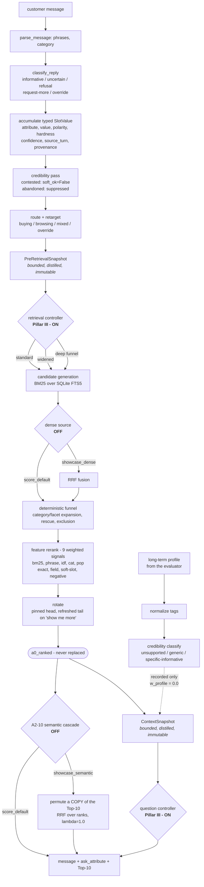

# Architecture

Six modules, ~4,800 lines, **Python standard library only**. The import graph is
acyclic; the *domain* graph is not, and the code says so rather than pretending
otherwise — retrieval asks dialogue what is credible, dialogue asks retrieval for
route configuration, and each module's header names the host capabilities it
relies on.

```text
starter/
  agent.py       DEFAULTS, PROFILES, the Agent that composes the mixins
  retrieval.py   candidate generation, funnel, feature rerank, rotation, A2 call site
  dialogue.py    routing, evidence accumulation, question policy, composition
  context.py     ContextSnapshot / PreRetrievalSnapshot, the two controllers, profile credibility
  evidence.py    SlotValue and the parsing/classification primitives
  catalog.py     FTS5 index, category/facet indexes, dense index, semantic field store
  semantic.py    the A2-10 cascade — OFF by default
```

## One turn, end to end



**Read the diagram for two things.** First, `a0_ranked` is **never replaced** —
the question controller, the context snapshot and the profile window all read
it, so the optional cascade cannot leak into any decision but the visible
ordering. Second, every dashed or `OFF` edge is a capability that exists, was
measured, and is disabled; the solid path is what produces 0.932067.

## Pillar I — intent routing and the hybrid pipeline

**Routing** classifies the opening turn into `buying` / `browsing` / `mixed` /
`override` and **retargets dynamically**: `browsing` is promoted to `buying` the
moment any slot becomes usable, so an exploratory opening that turns concrete
gets the precision track without waiting for a new session.

Each route carries its own retrieval topology — term cap, BM25 field weights,
funnel depth, question policy — rather than a global constant.

**Candidate generation** is BM25 over SQLite FTS5 across title, features,
details, description, categories and store. A **dense random-indexing** source
and **RRF fusion** are implemented and available (`showcase_dense`): they surface
candidates with *no lexical overlap at all* — 281 dense-only against 19
overlapping in the demo — and they are off because they cost Boundary MRR
1.000 to 0.870 and fail the contradiction guard.

**The deterministic funnel** expands by category node and facet, rescues
candidates that filters would have dropped, and excludes on hard evidence. It is
deterministic: same state, same pool, every time.

**Reranking** is nine hand-configured weighted features over the pooled
candidates — scalar configuration set by measurement, not learned parameters.
On the **public development set** recall@200 is **1.000**, so the bottleneck
there is ranking rather than retrieval. That is a finding about that corpus,
not a general claim about retrieval.

## Pillar II — multi-turn scenario evolution

Evidence is a **typed record**, not a bag of words:

```python
SlotValue(attribute, value, polarity, hardness, confidence,
          source_turn, provenance, active, soft_ok,
          catalog_support, contradiction)
```

* **polarity** separates "I want silk" from "not silk"; negatives never enter the
  query and penalise candidates that match them.
* **hardness** separates a requirement from a preference.
* **confidence** discounts open-world extraction against stated facts — and the
  denominator is the phrase *count*, not the confidence sum, so a lone
  low-confidence guess cannot score like a stated fact.
* **`soft_ok` / `active`** carry abandonment and contradiction: a value the
  customer contested, or one superseded before an override, stops being usable
  without being deleted.
* **`source_turn` and `provenance`** make erasure *targeted* — the terms a phrase
  contributed can be withdrawn with it.

**Override handling ships as `keep`**, and that is measured: this pipeline
*scores* rather than *filters*, so a stale constraint adds a little wrong credit
while forgetting destroys evidence. keep 0.9233, slot 0.9140, erase 0.8458.
Targeted erasure is implemented and one config key away.

**Request-more** pins the confident head and refreshes the tail with unseen
candidates — repeating an identical Top-10 burns a turn, rotating everything
wrecks MRR. **Over-generality** is detected from the pool's coarse-category
spread and forces a structured choice instead of an open prompt.

## Pillar III — dynamic context programming

Two snapshots, both **bounded, distilled and immutable**, computed from live
state and consumed by controllers that decide *how the pipeline runs this turn*:

| snapshot | consumer | decides |
|---|---|---|
| `PreRetrievalSnapshot` | retrieval controller | candidate depth, retrieval mode, and the reason code for both |
| `ContextSnapshot` | question controller | whether to ask, which attribute, and open vs structured rendering |

Both are **on** in `score_default`. Both emit a **reason code** on every turn
(`DEPTH_STANDARD`, `WIDEN_REQUEST_MORE`, `POOL_ATTRIBUTE_SELECTED`, ...), which
is what makes the demo legible and what made the shadow-vs-control comparison
possible before adoption.

**Starvation-aware orchestration:** when the surviving pool collapses, the
controller widens depth tenfold rather than returning a thin list — visible in
the demo as `widened (WIDEN_REQUEST_MORE, depth 1000)`.

### The long-term profile

> The evaluator supplies an external long-term preference profile. The agent
> distills it into bounded profile evidence and dynamically accepts, down-weights
> or rejects it against current-session evidence and candidate support. It does
> not invent cross-session memory because the evaluation API provides no stable
> user identity.

Each tag is judged against the live window: matches nothing gives
**unsupported**; matches more than half the pool gives **generic**, it separates
nothing; in between gives **specific informative**. The classification is
**recorded and never moves a rank** — Phase 6C1 found no demonstrated target
alignment, so `w_profile` is pinned at 0.0.

## Pillar IV — the evaluation matrix

| mechanism | what it prevents |
|---|---|
| exclusive **lease** in an isolated worktree | measuring a tree that moved mid-run |
| input **fingerprints** (agent, evaluator, catalog, datasets, caches, model) | quoting a number whose inputs are unknown |
| **append-only ledgers** | rewriting a result |
| **invalidation records** | deleting a wrong row instead of superseding it |
| **one citability predicate** | a report quoting a row no gate would accept |
| **pre-registration** | choosing the gate after seeing the number |
| **semantic fallback detection** | reporting A0's quality under A2's name |

Recorded per run: HR@10, MRR, MTTC, TechnicalScore, the four official scenario
slices, five robustness scenarios over five seeds, latency percentiles, cold
load, RSS, commit and dirty state, lease verdict, and the reason any row is not
citable.

## The A2-10 cascade, and why it is safe by construction

```text
candidates -> A0 rerank -> rotate -> a0_ranked -> [copy of Top-10] -> permute
```

It runs **after** rotation, never before — running it first would make the
semantic order an input to the rotation, and neither mechanism could then be
reasoned about alone. It reorders **a copy**; `a0_ranked` is never replaced.

`effective_k = min(semantic_rerank_k, top_k, len(ordered))`. The `top_k` clamp is
what makes the returned **set** invariant for any caller: without it, reordering
the first 10 could promote a rank-7 item into a returned five.

Because the result is a **permutation of the returned set**, and the evaluator's
hit test is `target in ranked`, **HR@10 and MTTC are provably invariant and only
MRR can move.** Verified, not assumed: exactly invariant at every lambda on
`sup-train`, and exactly invariant on the full-Agent `sup-val` run.

Every failure path — model absent, load failure, inference failure, a
non-permutation from the scorer — returns the A0 ordering **byte-exactly**, with
a distinct reason code. Four of those reasons mark an experiment shard
**invalid**, because a run that silently fell back measured A0 and would have
reported it under A2's name.
